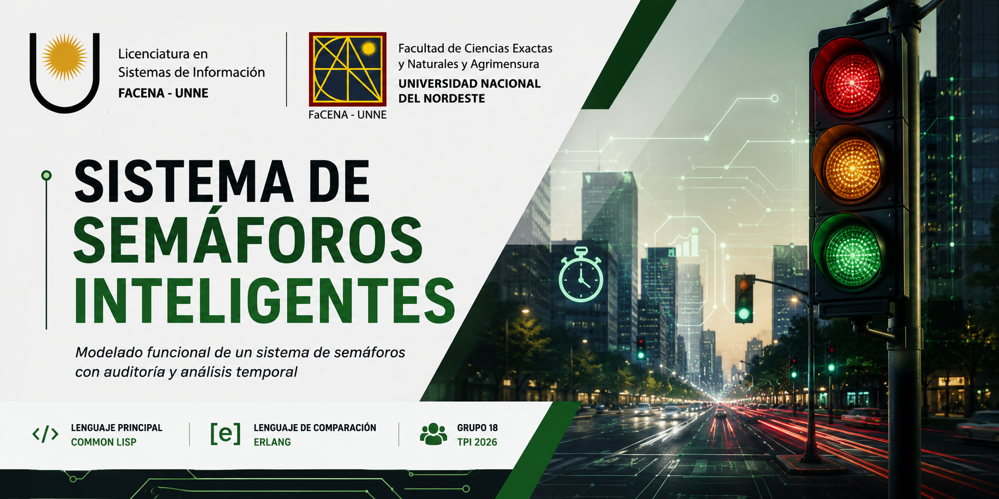

<p align="center">
  
</p>

# Sistema de semaforos inteligentes- Grupo 18

## Trabajo practico integrador 2026: Programacion Funcional
**Grupo:** 18
**Fecha de entrega**: 16 de junio
**Lenguaje principal:** Common Lisp
**Lenguaje de comparacion:** Erlang

## Integrantes 

- Gonzalez, Rocio Anabel - @Anabel0710
- Romani, Valentino - @valrom12
- Gomez, Matias Gabriel - @MatiasGabriel
- Lafuente, Noelia Magali -  @noelialafuente18
- Bereciartua Serpa, Osvaldo Agustin - @agustín-bereciartua


## Objetivo
El objetivo es modelar un sistema de semáforos inteligentes utilizando **Common Lisp** utilizando los principios del paradigma funcional:
 **funciones puras**
 **inmutabilidad**
 **Composicion funcional**
 **Ausencia de estructuras imperativas de iteracion**
 **Modelado mediante funciones y expresiones**

Ademas, incluye auditoría con fechas legibles gracias a la librería **local-time** y una comparativa con Erlang.


## RECURSOS:
* Informe: \TPI-Funcional-2026-Grupo18\docs\INFORME.md 1.pdf
* Video de presentacion: 
https://youtu.be/ryHYdYl_DeA?si=KLjKHfmlXdUIvgOU


# Funcionalidades implementadas:

## Requerimiento 1
* Funcion transicion 
* Control de estados del semaforo 
* Validacion de transiciones

## Requerimiento 2
* Funcion timer-semaforo
* Calculo del color segun el tiempo

## Requerimiento 3
* Sistema de auditoria 
* Registro de cambios de estado 
* Uso de la libreria local-time para mostrar fechas legibles 

## Requerimiento 4
* Calculo de duracion del ciclo completo
* Recomendacion sobre la duracion del ciclo 

## Requerimiento 5
* Calculo de ciclos completos para una determinada cantidad de minutos

## Requerimiento 6
* Distribucion porcentual del tiempo de cada color durante 1 hora 

## Requerimiento 7
* Ejemplos de uso
* casos normales 
* casos alternativos 
* casos invalidos


## Comparativa con Erlang

La carpeta `comparativa/` contiene una reimplementación parcial del sistema en Erlang, incluyendo las funciones `transicion` y `timer`, con el objetivo de analizar diferencias sintácticas y conceptuales entre ambos lenguajes funcionales.

## Tecnologias usadas: 

* Common Lisp
* local-time
* Quicklisp
* Git 
* GitHub 

## Dependencias

Para ejecutar el proyecto se requiere:

- SBCL
- Quicklisp
- local-time

Carga de dependencias:

```lisp
(load "C:/Users/usuario/quicklisp/setup.lisp")
(ql:quickload :local-time)
```

Instalación:

```lisp
(ql:quickload :local-time)
```

## Ejecucion

1. Instalar SBCL y Quicklisp.
2. Clonar el repositorio.
3. Abrir el archivo `core.lisp`.
4. Cargar el archivo en el intérprete de Common Lisp.
5. Ejecutar las funciones de prueba.

Ejemplos:

```lisp
(transicion 'en-rojo 'verde)

(timer-semaforo 100)

(auditoria-cambio 1717520000 'en-rojo 'en-verde)

(duracion-ciclo 90 6 120)

(recomendacion-ciclo 216)

(ciclos-por-tiempo 15)

(distribucion-temporal)
```

## Estructura del repositorio
```
TPI-Funcional-2026-Grupo18/
├── lisp/
│   └── core.lisp
│
├── comparativa/
│   └── solucion.erl
│
├── docs/
│   ├── INFORME.pdf
│   └── HONOR.md
│
└── README.md
```


